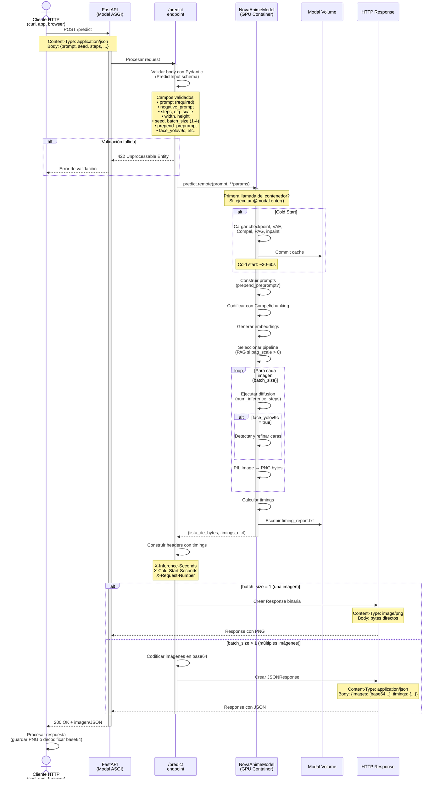
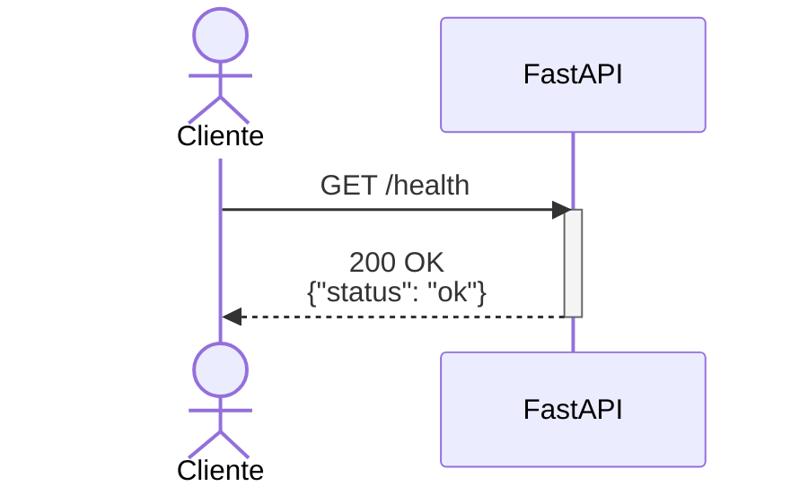
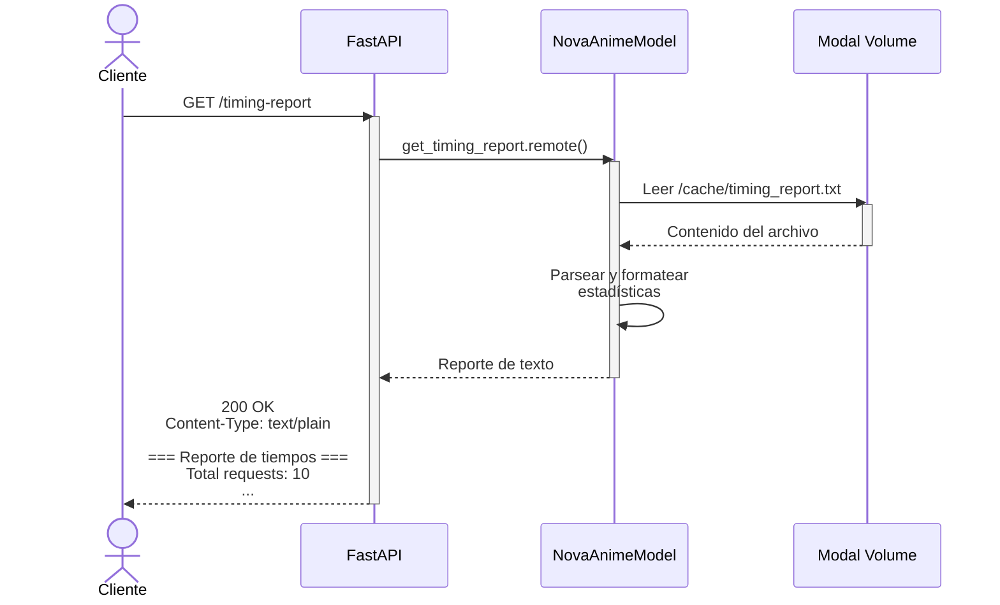

# Flujo de Ejecución: API HTTP (FastAPI)

Este diagrama muestra el flujo cuando se consume la aplicación como API REST mediante `modal serve`.

## Diagrama de Secuencia



## Otros Endpoints

### GET /health



### GET /timing-report



## Detalles del Flujo

### 1. Inicio del Servicio

```bash
modal serve app.py
```

Modal despliega:
- FastAPI app como web function (ASGI)
- URL pública: `https://xxx--nova-anime-ilxl-fastapi.modal.run`
- Auto-scaling según demanda

### 2. Request HTTP

#### Ejemplo con una imagen:

```bash
curl -X POST "https://TU-URL/predict" \
  -H "Content-Type: application/json" \
  -d '{
    "prompt": "score_9, masterpiece, 1girl, cherry blossoms",
    "seed": 42,
    "steps": 25,
    "cfg_scale": 6.0
  }' \
  --output imagen.png
```

**Respuesta:**
- Status: `200 OK`
- Headers:
  - `Content-Type: image/png`
  - `X-Inference-Seconds: 10.23`
  - `X-Cold-Start-Seconds: 0.0`
  - `X-Request-Number: 5`
- Body: bytes PNG directos

#### Ejemplo con múltiples imágenes:

```bash
curl -X POST "https://TU-URL/predict" \
  -H "Content-Type: application/json" \
  -d '{
    "prompt": "score_9, masterpiece, 1girl",
    "batch_size": 4,
    "seed": 42
  }'
```

**Respuesta:**
```json
{
  "images": [
    "iVBORw0KGgoAAAANSUhEUgAA...",
    "iVBORw0KGgoAAAANSUhEUgAA...",
    "iVBORw0KGgoAAAANSUhEUgAA...",
    "iVBORw0KGgoAAAANSUhEUgAA..."
  ],
  "timings": {
    "inference_seconds": 12.45,
    "cold_start_seconds": 0.0,
    "request_number": 6
  }
}
```

### 3. Validación con Pydantic

El endpoint valida el body usando `PredictInput` schema:

```python
class PredictInput(BaseModel):
    prompt: str  # Required
    negative_prompt: Optional[str] = "nsfw, naked"
    steps: int = 25
    cfg_scale: float = 6.0
    guidance_rescale: float = 1.0
    clip_skip: Optional[int] = 2
    pag_scale: float = 0.0
    width: int = 1024
    height: int = 1024
    seed: int = -1  # -1 = random
    batch_size: int = 1  # 1-4
    prepend_preprompt: bool = True
    face_yolov9c: bool = True
    hand_yolov9c: bool = False
    person_yolov8m_seg: bool = False
```

### 4. Respuesta según Batch Size

| Batch Size | Content-Type | Body Format |
|------------|--------------|-------------|
| 1 | `image/png` | Bytes PNG directos |
| 2-4 | `application/json` | JSON con array de base64 |

### 5. Headers de Timing

Todas las respuestas incluyen headers personalizados:

- `X-Inference-Seconds`: Tiempo de generación (segundos)
- `X-Cold-Start-Seconds`: Tiempo de cold start (0 si warm)
- `X-Request-Number`: Número de request del contenedor

## Endpoints Disponibles

### POST /predict
- **Función:** Generar imágenes
- **Input:** JSON con parámetros del modelo
- **Output:** PNG binario (1 imagen) o JSON base64 (2-4 imágenes)
- **Timeout:** 60 segundos (configurable)

### GET /timing-report
- **Función:** Obtener estadísticas de rendimiento
- **Output:** Texto plano con reporte acumulado
- **Datos:** Total requests, cold start, tiempos avg/min/max

### GET /health
- **Función:** Healthcheck simple
- **Output:** `{"status": "ok"}`
- **Uso:** Monitoring, load balancers

## Configuración del Servicio

En `endpoints.py`:

```python
@app.function(
    timeout=60,  # Timeout por request
    secrets=[modal.Secret.from_name("nova-anime-checkpoint")],
)
@modal.asgi_app()
def fastapi_app():
    # FastAPI app initialization
    ...
```

## Tiempos de Respuesta

| Escenario | Tiempo típico |
|-----------|---------------|
| Primera request (cold start) | ~40-70s |
| Requests siguientes (warm) | ~8-15s |
| Batch de 4 imágenes | ~30-40s |
| Con face refinement | +2-4s por cara |

## Escalado Automático

Modal gestiona automáticamente:
- **Scale to zero:** Si no hay requests, no hay costo
- **Auto-scaling:** Múltiples contenedores en paralelo según demanda
- **Warm containers:** Se mantienen ~5 minutos después del último request
- **Concurrencia:** Múltiples requests simultáneos → múltiples contenedores

## Manejo de Errores

```python
try:
    images, timings = NovaAnimeModel().predict.remote(...)
    # ...
except Exception as e:
    raise HTTPException(status_code=500, detail=str(e))
```

Errores comunes:
- **422 Unprocessable Entity:** Body JSON inválido
- **500 Internal Server Error:** Error en generación (CUDA, OOM, etc.)
- **504 Gateway Timeout:** Generación excedió timeout (60s)

## Integración con Python

```python
import requests
import base64
from pathlib import Path

# Una imagen (respuesta binaria)
response = requests.post(
    "https://TU-URL/predict",
    json={
        "prompt": "score_9, masterpiece, 1girl",
        "seed": 42,
        "steps": 25
    }
)
Path("output.png").write_bytes(response.content)

# Múltiples imágenes (respuesta JSON)
response = requests.post(
    "https://TU-URL/predict",
    json={
        "prompt": "score_9, masterpiece, 1girl",
        "batch_size": 4,
        "seed": 42
    }
)
data = response.json()
for i, img_b64 in enumerate(data["images"]):
    img_bytes = base64.b64decode(img_b64)
    Path(f"output_{i}.png").write_bytes(img_bytes)
```

## Compatibilidad con Replicate

La API imita la estructura de [Replicate Nova Anime](https://replicate.com/aisha-ai-official/nova-anime-ilxl-v5.5), con ligeras diferencias:

| Parámetro Replicate | Parámetro Modal | Notas |
|---------------------|-----------------|-------|
| `cfg_scale` | `cfg_scale` | Idéntico |
| `num_outputs` | `batch_size` | Nombre diferente, misma función |
| `scheduler` | N/A | Fijo en Euler Ancestral |
| Output | PNG binario | Mismo formato (1 imagen) |
