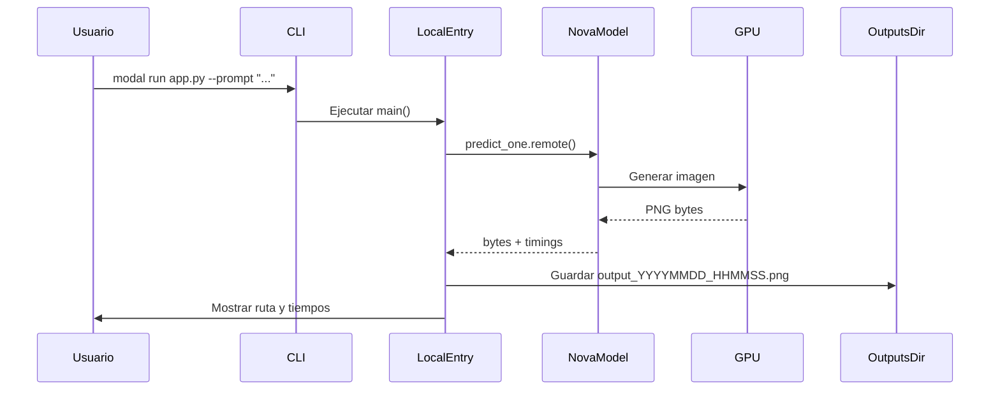
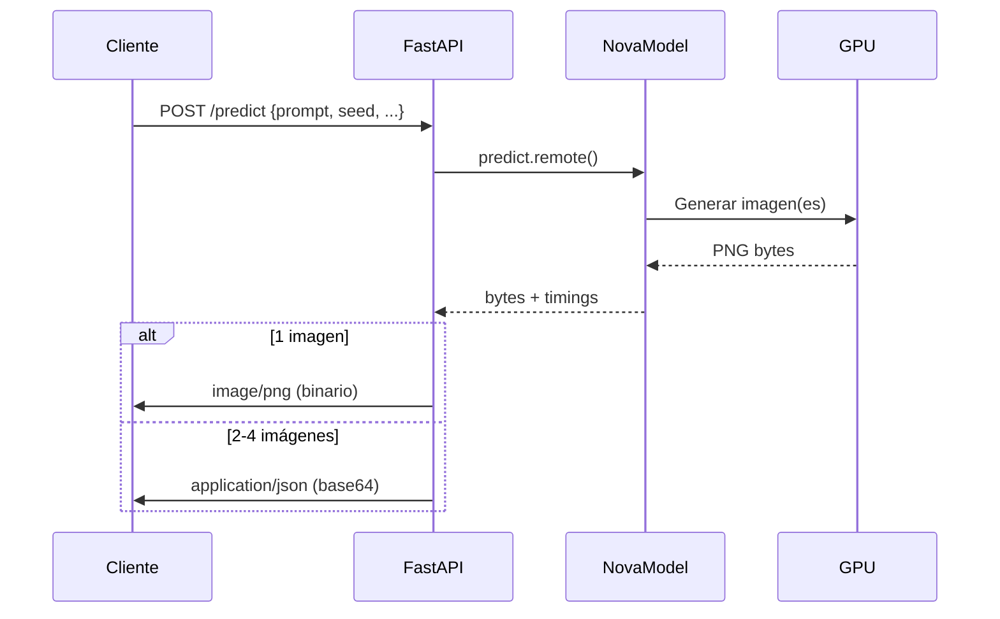
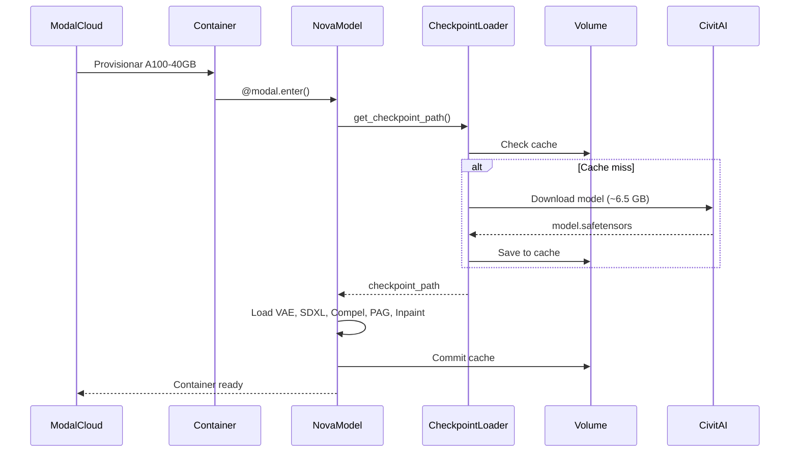
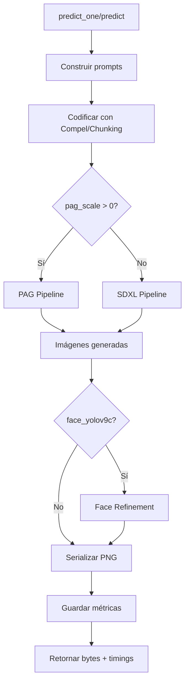

# Visión General de la Arquitectura

Este documento proporciona una visión general de la arquitectura completa del sistema Nova Anime IL v5.5 en Modal.

## Diagrama de Arquitectura

```mermaid
graph TB
    subgraph "Usuario"
        CLI[Modal CLI<br/>modal run/serve]
        HTTP[Cliente HTTP<br/>curl, app, browser]
    end
    
    subgraph "Modal Cloud"
        subgraph "Entry Points"
            LocalEntry[@local_entrypoint<br/>main]
            FastAPI[FastAPI<br/>@asgi_app]
        end
        
        subgraph "GPU Container (A100-40GB)"
            NovaModel[NovaAnimeModel<br/>@modal.cls]
            
            subgraph "Inicialización (@modal.enter)"
                CheckpointLoader[Checkpoint Loader<br/>get_checkpoint_path]
                VAE[VAE fp16-fix]
                SDXL[SDXL Pipeline]
                CompelInit[Compel]
                PAGInit[PAG Pipeline]
                InpaintInit[Inpaint Pipeline]
            end
            
            subgraph "Inferencia (predict/predict_one)"
                PromptBuilder[Prompt Builder<br/>prepend_preprompt]
                Encoder[Prompt Encoder<br/>Compel/Chunking]
                DiffusionPipe[Diffusion Pipeline<br/>Euler Ancestral]
                PAGPipe[PAG Pipeline<br/>pag_scale > 0]
                FaceRefine[Face Refiner<br/>YOLOv9c + Inpaint]
                Serializer[Serializer<br/>PIL → PNG bytes]
            end
        end
        
        subgraph "Storage"
            Volume[Modal Volume<br/>/cache]
            CheckpointCache[checkpoint/<br/>model.safetensors]
            TimingReport[timing_report.txt]
        end
        
        subgraph "Secrets"
            Secret[nova-anime-checkpoint]
            CivitKey[CIVITAI_API_KEY]
            CheckURL[CHECKPOINT_URL]
            HFToken[HF_TOKEN]
        end
    end
    
    subgraph "External Services"
        CivitAI[CivitAI API<br/>Model Download]
        HuggingFace[Hugging Face Hub<br/>Fallback Models]
    end
    
    subgraph "Local Machine"
        OutputsDir[outputs/<br/>Generated Images]
    end
    
    %% Flujo CLI
    CLI -->|modal run| LocalEntry
    LocalEntry -->|predict_one.remote| NovaModel
    NovaModel -->|PNG bytes| LocalEntry
    LocalEntry -->|Save file| OutputsDir
    
    %% Flujo HTTP
    HTTP -->|POST /predict| FastAPI
    FastAPI -->|predict.remote| NovaModel
    NovaModel -->|PNG/JSON| FastAPI
    FastAPI -->|Response| HTTP
    
    %% Cold Start
    NovaModel -->|First call| CheckpointLoader
    CheckpointLoader -->|Check cache| Volume
    CheckpointLoader -->|Download if miss| CivitAI
    CheckpointLoader -->|Fallback| HuggingFace
    CheckpointLoader -->|Save| CheckpointCache
    CheckpointLoader -->|Load .safetensors| VAE
    VAE --> SDXL
    SDXL --> CompelInit
    CompelInit --> PAGInit
    PAGInit --> InpaintInit
    
    %% Inferencia
    NovaModel -->|Build prompts| PromptBuilder
    PromptBuilder --> Encoder
    Encoder --> DiffusionPipe
    Encoder --> PAGPipe
    DiffusionPipe --> FaceRefine
    PAGPipe --> FaceRefine
    FaceRefine --> Serializer
    Serializer -->|Write metrics| TimingReport
    TimingReport --> Volume
    
    %% Secrets
    Secret --> CivitKey
    Secret --> CheckURL
    Secret --> HFToken
    CheckpointLoader -.->|Use| CivitKey
    CheckpointLoader -.->|Use| CheckURL
    CheckpointLoader -.->|Use| HFToken
    
    classDef entry fill:#e1f5ff,stroke:#01579b
    classDef gpu fill:#fff3e0,stroke:#e65100
    classDef storage fill:#f3e5f5,stroke:#4a148c
    classDef external fill:#e8f5e9,stroke:#1b5e20
    classDef local fill:#fce4ec,stroke:#880e4f
    
    class LocalEntry,FastAPI entry
    class NovaModel,CheckpointLoader,VAE,SDXL,CompelInit,PAGInit,InpaintInit,PromptBuilder,Encoder,DiffusionPipe,PAGPipe,FaceRefine,Serializer gpu
    class Volume,CheckpointCache,TimingReport storage
    class CivitAI,HuggingFace external
    class OutputsDir local
```

## Componentes Principales

### 1. Entry Points

#### Local Entrypoint (`modal run`)
```python
@app.local_entrypoint()
def main(prompt: str, **kwargs):
    # Ejecuta en máquina local
    # Llama a GPU remota
    # Guarda resultado localmente
```

**Características:**
- Se ejecuta en la máquina del usuario
- Parsea argumentos de CLI
- Llama métodos remotos GPU
- Descarga y guarda imágenes

**Uso:**
```bash
modal run app.py --prompt "..."
```

#### FastAPI Endpoint (`modal serve`)
```python
@app.function()
@modal.asgi_app()
def fastapi_app():
    # API REST expuesta
    # POST /predict
    # GET /timing-report
    # GET /health
```

**Características:**
- API HTTP pública
- Auto-scaling
- Respuestas PNG o JSON
- Headers con métricas

**Uso:**
```bash
modal serve app.py
# → https://xxx--nova-anime-ilxl-fastapi.modal.run
```

### 2. GPU Container (Clase Modal)

```python
@app.cls(
    gpu="A100-40GB",
    timeout=600,
    volumes={"/cache": volume},
    secrets=[Secret.from_name("nova-anime-checkpoint")],
)
class NovaAnimeModel:
    @modal.enter()
    def load(self): ...
    
    @modal.method()
    def predict(self, ...): ...
    
    @modal.method()
    def predict_one(self, ...): ...
    
    @modal.method()
    def get_timing_report(self): ...
```

**Características:**
- Contenedor serverless con GPU
- Auto-scaling según demanda
- Warm containers (~5 min después del último request)
- Volume persistente para cache

**Recursos:**
- GPU: A100-40GB (configurable)
- RAM: ~40-60 GB
- Storage: Modal Volume (ilimitado)

### 3. Checkpoint Loader

Estrategia de resolución de checkpoint con 5 niveles de fallback:

```mermaid
graph LR
    Start[get_checkpoint_path] --> L1{Embebido?}
    L1 -->|Sí| Return1[/local/model.safetensors]
    L1 -->|No| L2{CHECKPOINT_PATH?}
    L2 -->|Sí| Return2[env var path]
    L2 -->|No| L3{Cache?}
    L3 -->|Sí| Return3[/cache/checkpoint/...]
    L3 -->|No| L4{CHECKPOINT_URL?}
    L4 -->|Sí| Download1[Download CivitAI/Custom]
    Download1 --> Return4[/cache/checkpoint/...]
    L4 -->|No| Download2[Download HuggingFace]
    Download2 --> Return5[/cache/checkpoint/...]
```

**Tiempos:**
- Embebido/PATH/Cache: ~0s
- Primera descarga: ~2-5 min
- Segunda descarga (cache): ~0s

### 4. Pipeline Components

#### VAE fp16-fix
```python
vae = AutoencoderKL.from_pretrained(
    "madebyollin/sdxl-vae-fp16-fix",
    torch_dtype=torch.float16,
)
```

**Propósito:** Evita blur y NaN en decodificado SDXL

#### SDXL Pipeline
```python
pipe = StableDiffusionXLPipeline.from_single_file(
    checkpoint_path,
    torch_dtype=torch.float16,
    vae=vae,
)
pipe.scheduler = EulerAncestralDiscreteScheduler.from_config(...)
```

**Componentes:**
- UNet (diffusion model)
- Text Encoder 1 & 2
- VAE (encoder & decoder)
- Scheduler (Euler Ancestral)

#### Compel
```python
compel = Compel(
    tokenizer=[pipe.tokenizer, pipe.tokenizer_2],
    text_encoder=[pipe.text_encoder, pipe.text_encoder_2],
    requires_pooled=[False, True],
)
```

**Propósito:**
- Prompt weighting: `(word:1.2)`, `[word]`
- Dual text encoders (SDXL)
- Pooled embeddings

#### PAG Pipeline
```python
pipe_pag = AutoPipelineForText2Image.from_pipe(
    pipe,
    enable_pag=True,
    pag_applied_layers=["mid"]
)
```

**Propósito:**
- Perturbed-Attention Guidance
- Mejora estructura de la imagen
- Opcional (pag_scale > 0)

#### Inpaint Pipeline
```python
pipe_inpaint = StableDiffusionXLInpaintPipeline.from_single_file(
    checkpoint_path,
    torch_dtype=torch.float16,
    vae=vae,
)
```

**Propósito:**
- Face refinement (ADetailer-style)
- YOLOv9c detection + inpainting
- Opcional (face_yolov9c=True)

### 5. Modal Volume (Storage Persistente)

```
/cache/
├── checkpoint/
│   └── model.safetensors    # ~6.46 GB (Nova Anime IL v5.5)
├── timing_report.txt         # Métricas acumuladas
└── models/                   # Cache de HuggingFace
```

**Características:**
- Persistente entre cold starts
- Compartido entre contenedores
- Auto-commit después de cambios
- Sin límite de tamaño

### 6. Secrets (Credenciales)

**Secret name:** `nova-anime-checkpoint`

**Variables:**
```bash
# Opción 1: CivitAI
CHECKPOINT_URL="https://civitai.com/api/download/models/1500882"
CIVITAI_API_KEY="tu_token"

# Opción 2: HuggingFace
NOVA_ANIME_HF_ID="usuario/repo"
NOVA_ANIME_HF_FILENAME="model.safetensors"
HF_TOKEN="tu_token"

# Opción 3: Custom
CHECKPOINT_URL="https://s3.amazonaws.com/bucket/model.safetensors"
```

## Flujos de Ejecución

### Flujo 1: Modal Run (CLI)



**Duración:**
- Primera ejecución (cold start): ~40-70s
- Ejecuciones siguientes (warm): ~8-15s

### Flujo 2: API HTTP



**Endpoints:**
- `POST /predict` - Generar imágenes
- `GET /timing-report` - Métricas
- `GET /health` - Healthcheck

### Flujo 3: Cold Start



**Duración:**
- Con cache: ~30-40s
- Sin cache (primera vez): ~3-6 min

### Flujo 4: Inferencia



**Duración:** ~8-18s (depende de configuración)

## Configuración

### GPU

```python
@app.cls(
    gpu="A100-40GB",  # Opciones: A10G, A100-40GB, A100-80GB, H100
    timeout=600,       # Timeout por método (segundos)
)
```

**Recomendaciones:**
- **Desarrollo:** A10G (más barato)
- **Producción:** A100-40GB (balance costo/rendimiento)
- **Alta demanda:** A100-80GB o H100

### Volume

```python
volume = modal.Volume.from_name("nova-anime-cache")

@app.cls(
    volumes={"/cache": volume},
)
```

**Uso:**
- Cache de checkpoint (~6.5 GB)
- Timing reports (~1-10 KB)
- Cache de HuggingFace models

### Secrets

```python
@app.cls(
    secrets=[modal.Secret.from_name("nova-anime-checkpoint")],
)
```

**Crear en Modal Dashboard:**
1. Ir a https://modal.com/secrets
2. "New Secret" → "Custom"
3. Name: `nova-anime-checkpoint`
4. Agregar variables

### Timeouts

```python
@app.function(
    timeout=60,  # FastAPI endpoint: 60s
)

@app.cls(
    timeout=600,  # Métodos de clase: 10 min
)
```

## Escalado y Rendimiento

### Auto-scaling

Modal gestiona automáticamente:
- **Scale to zero:** Sin requests = sin costo
- **Scale up:** Múltiples contenedores en paralelo
- **Scale down:** Contenedores inactivos se reciclan (~5 min)

### Concurrencia

```python
@app.cls(
    concurrency_limit=10,  # Máximo 10 requests por contenedor
    allow_concurrent_inputs=5,  # Máximo 5 requests simultáneos
)
```

**Comportamiento:**
- Requests simultáneos → mismo contenedor (si bajo límite)
- Sobrecarga → nuevos contenedores
- No hay límite global de contenedores

### Warm Containers

Modal mantiene contenedores "warm" (~5 min):
- Primera llamada: cold start (~30-60s)
- Llamadas siguientes (< 5 min): ~0s overhead
- Después de 5 min inactivo: contenedor se recicla

### Optimizaciones

**1. Cache de checkpoint:**
```python
# Primera ejecución: descarga (~5 min)
# Siguientes: cache hit (~0s)
```

**2. Desactivar face refinement:**
```python
ENABLE_FACE_REFINEMENT=0  # Ahorra ~8-10s en cold start
```

**3. Reducir steps:**
```python
num_inference_steps=20  # Default 25, mínimo 15
```

**4. Batch processing:**
```python
predict(prompt, num_outputs=4)  # 4 imágenes en ~12-16s
```

## Costos Estimados

### GPU Time (Modal pricing)

| GPU | Costo/hora | Cold start | Inferencia | Costo por imagen |
|-----|------------|------------|------------|------------------|
| A10G | $0.50 | ~30s | ~10s | ~$0.003 |
| A100-40GB | $1.10 | ~30s | ~8s | ~$0.005 |
| A100-80GB | $1.50 | ~30s | ~8s | ~$0.007 |
| H100 | $3.50 | ~25s | ~6s | ~$0.010 |

**Nota:** Precios aproximados, verificar en https://modal.com/pricing

### Storage (Volume)

- **Cache:** ~6.5 GB checkpoint + reports
- **Costo:** Incluido en plan (primeros 10 GB gratis)

### Network (Egress)

- **Download checkpoint:** ~6.5 GB (primera vez)
- **Download imágenes:** ~2-3 MB por imagen
- **Costo:** Incluido en plan

## Monitoreo y Debugging

### Logs

```bash
# Logs en tiempo real
modal logs nova-anime-ilxl

# Logs de una función específica
modal logs nova-anime-ilxl::NovaAnimeModel
```

### Métricas

**En Headers HTTP:**
```
X-Inference-Seconds: 10.23
X-Cold-Start-Seconds: 0.0
X-Request-Number: 5
```

**En Volume:**
```
/cache/timing_report.txt
```

**Endpoint de métricas:**
```bash
curl https://TU-URL/timing-report
```

### Dashboard

Modal Dashboard: https://modal.com/apps

- Contenedores activos
- GPU utilization
- Request history
- Error logs
- Billing

## Limitaciones y Consideraciones

### GPU Memory (A100-40GB)

**Capacidad:**
- Checkpoint: ~6.5 GB
- VAE: ~350 MB
- SDXL pipeline: ~12 GB
- Compel: ~1 GB
- PAG: ~2 GB adicional
- Inpaint: ~12 GB
- Total: ~34 GB
- Disponible para inference: ~6 GB

**Límites:**
- Batch size máximo: 4 imágenes
- Resolución máxima: 1024x1024 (SDXL standard)
- Para resoluciones mayores: A100-80GB o H100

### Timeouts

- **API HTTP:** 60s (configurable)
- **Métodos GPU:** 600s (10 min)
- **Descarga checkpoint:** Sin límite (primera vez)

### Rate Limits

**Modal:**
- Sin límite de requests
- Auto-scaling según demanda
- Límite de concurrencia configurable

**CivitAI:**
- Rate limit de API (no documentado)
- Solución: usar cache o URL custom

### Recomendaciones de Producción

1. **Checkpoint hosting:**
   - Usar Cloudflare R2 o S3 en misma región
   - No depender de CivitAI para producción

2. **GPU selection:**
   - A100-40GB para balance costo/rendimiento
   - H100 solo si latencia crítica

3. **Monitoring:**
   - Configurar alertas en Modal Dashboard
   - Monitorear timing reports
   - Track error rates

4. **Caching:**
   - Implementar cache de imágenes (opcional)
   - Redis para resultados frecuentes

5. **Error handling:**
   - Retry logic para failures
   - Fallback a modelo alternativo
   - Rate limiting en API
