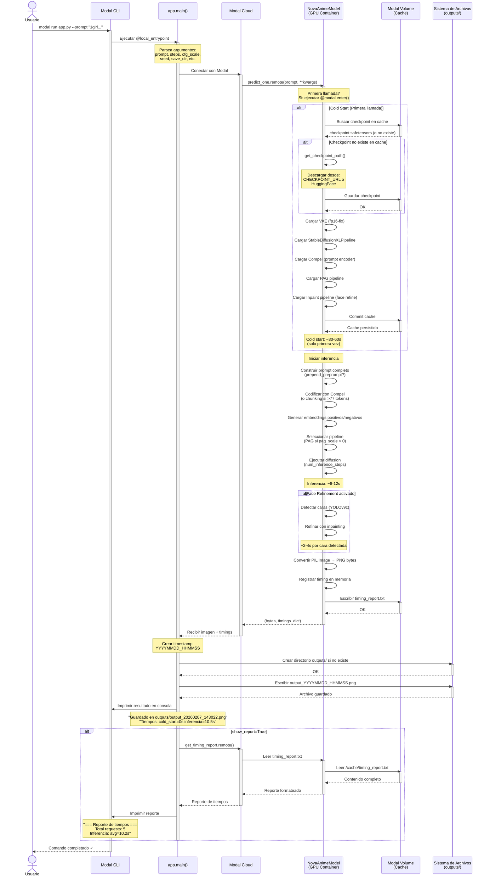

# Flujo de Ejecución: Modal Run (CLI Local)

Este diagrama muestra el flujo completo cuando un usuario ejecuta `modal run app.py --prompt "..."` desde la terminal.

## Diagrama de Secuencia



## Detalles del Flujo

### 1. Inicio del Comando
- Usuario ejecuta `modal run` con argumentos
- Modal CLI parsea los argumentos y los pasa a `main()`

### 2. Local Entrypoint
- Función decorada con `@app.local_entrypoint()`
- Recibe argumentos: `prompt`, `steps`, `cfg_scale`, `seed`, `save_dir`, etc.
- Convierte argumentos de CLI a parámetros del modelo

### 3. Llamada Remota
- `NovaAnimeModel().predict_one.remote()` ejecuta en GPU remota
- Modal serializa los argumentos y los envía al contenedor GPU

### 4. Cold Start (Solo primera vez)
- **Duración:** ~30-60 segundos
- Descarga checkpoint si no está en cache (~6.46 GB)
- Carga VAE, pipeline SDXL, Compel, PAG, inpaint
- Persiste cache en Modal Volume

### 5. Inferencia
- **Duración:** ~8-12 segundos
- Codificación de prompts con Compel
- Generación con diffusion pipeline
- Refinado de caras (opcional, +2-4s)

### 6. Descarga y Guardado
- Imagen se recibe como bytes PNG
- Se guarda en `outputs/output_YYYYMMDD_HHMMSS.png`
- Se imprimen métricas de tiempo

### 7. Reporte (Opcional)
- Si `--show-report`, obtiene estadísticas acumuladas
- Muestra cold start, tiempos promedio/min/max de inferencia

## Argumentos Disponibles

```bash
modal run app.py \
  --prompt "score_9, masterpiece, 1girl, cherry blossoms" \
  --prepend-preprompt true \
  --negative-prompt "nsfw, naked" \
  --steps 25 \
  --cfg-scale 6.0 \
  --guidance-rescale 1.0 \
  --clip-skip 2 \
  --seed 42 \
  --save-dir ./outputs \
  --show-report true
```

## Tiempos Típicos

| Fase | Primera ejecución | Ejecuciones siguientes |
|------|-------------------|------------------------|
| Cold start | ~30-60s | ~0s (contenedor warm) |
| Inferencia | ~8-12s | ~8-12s |
| Face refine | +2-4s por cara | +2-4s por cara |
| Descarga | ~0.5s | ~0.5s |
| **Total** | **~40-75s** | **~8-15s** |

## Optimizaciones

1. **Cache persistente:** Checkpoint se descarga solo una vez
2. **Warm containers:** Modal mantiene contenedores activos (~5 min)
3. **Compel:** Codificación rápida de prompts
4. **PAG opcional:** Solo se usa si `pag_scale > 0`
5. **Face refine configurable:** Puede desactivarse con variable de entorno
